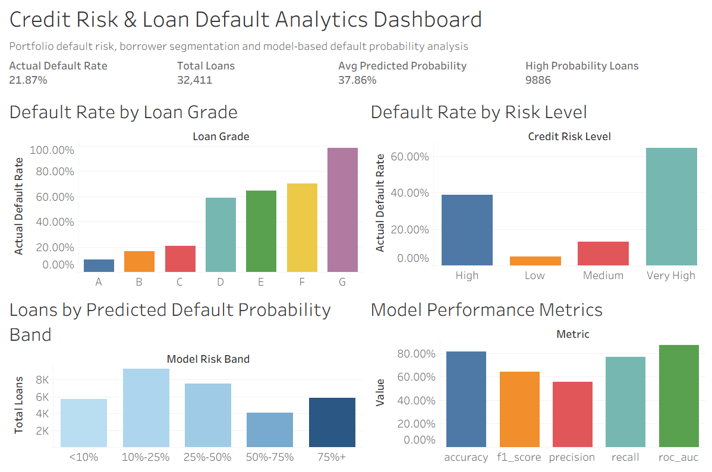
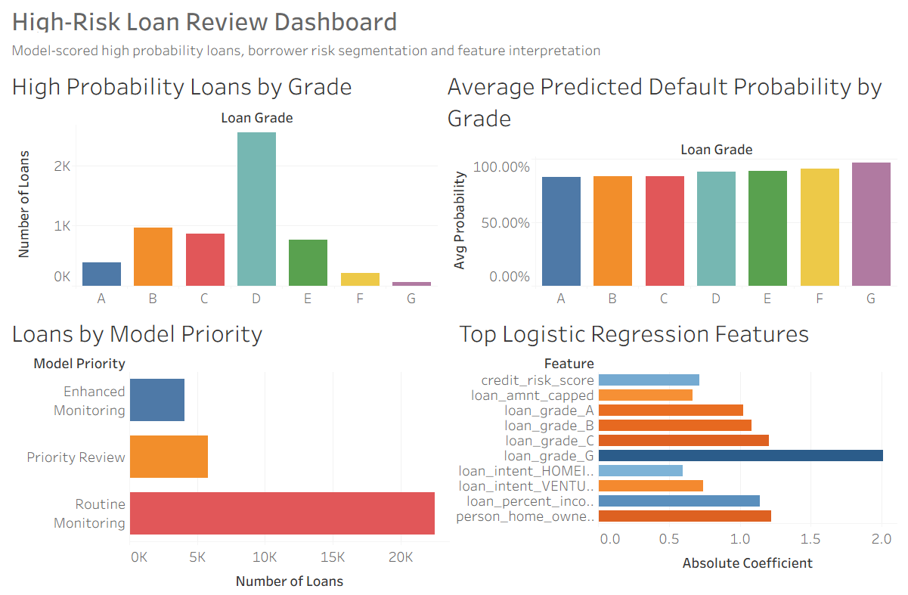

# Credit Risk & Loan Default Analytics

## 1. Project Overview

This project analyses a public credit risk dataset to understand borrower risk characteristics, loan default patterns and model-based default probability outcomes.

The project is designed to demonstrate credit risk analytics, exploratory data analysis, default rate analysis, borrower risk segmentation, baseline default prediction modelling and Tableau dashboard reporting.

The workflow combines Python, pandas, scikit-learn and Tableau Public to build an end-to-end credit risk analytics project, from raw loan-level data to model-scored portfolio monitoring dashboards.

## 2. Business Problem

Financial institutions need to assess borrower credit risk and monitor loan portfolio quality. Common analytical questions include:

* Which borrower characteristics are associated with higher default risk?
* How do default rates differ by loan grade, income, home ownership, loan intent, interest rate and loan-to-income ratio?
* Which loans should be prioritised for enhanced monitoring or review?
* How well can a baseline model separate higher-risk and lower-risk borrowers?
* How can credit risk results be summarised for portfolio monitoring and management review?

This project builds a structured analytics workflow to explore loan default patterns, segment borrowers by risk level and prepare dashboard outputs for credit risk monitoring.

## 3. Data Source

The project uses a public Kaggle credit risk dataset containing borrower-level and loan-level features.

Key fields include:

* `person_age`: borrower age
* `person_income`: annual income
* `person_home_ownership`: home ownership status
* `person_emp_length`: employment length in years
* `loan_intent`: loan purpose
* `loan_grade`: loan grade
* `loan_amnt`: loan amount
* `loan_int_rate`: interest rate
* `loan_status`: target variable, where 0 = non-default and 1 = default
* `loan_percent_income`: loan amount as a percentage of income
* `cb_person_default_on_file`: historical default indicator
* `cb_person_cred_hist_length`: credit history length

The dataset is used for portfolio demonstration and does not contain any confidential customer, bank or personally identifiable information.

## 4. Tools Used

* Python
* pandas
* NumPy
* scikit-learn
* Logistic Regression
* Tableau Public
* Excel / CSV files
* VS Code

## 5. Workflow

1. Created the project folder structure and tested the Python environment.
2. Loaded and inspected the credit risk dataset.
3. Cleaned missing values, removed duplicate rows and standardised field names.
4. Created analytical bands for income, age, loan amount and interest rate.
5. Generated default rate summaries by loan grade, home ownership, loan intent, income band, age band, interest rate band and loan amount band.
6. Built a rule-based credit risk score using loan grade, home ownership, loan-to-income ratio, interest rate, previous default history, employment length and credit history length.
7. Assigned each loan a credit risk level: Low, Medium, High or Very High.
8. Trained a baseline logistic regression model to predict loan default.
9. Generated predicted default probabilities, predicted default flags, model risk bands and model priority categories.
10. Prepared Tableau-ready summary tables for portfolio monitoring and high-risk loan review.
11. Built Tableau dashboards for credit risk portfolio overview and high-risk loan review.

## 6. Credit Risk Segmentation

A rule-based credit risk score was created using the following components:

* Loan grade risk score
* Home ownership risk score
* Loan-to-income risk score
* Interest rate risk score
* Previous default risk score
* Employment length risk score
* Credit history length risk score

Each loan was assigned one of four risk levels:

* Low
* Medium
* High
* Very High

The rule-based score is designed for portfolio demonstration and should not be interpreted as an official credit score.

## 7. Default Prediction Model

A baseline logistic regression model was trained to predict loan default.

The model uses borrower characteristics, loan characteristics, historical default indicators and rule-based credit risk features.

The modelling workflow includes:

* Train/test split
* Numeric feature scaling
* Categorical feature encoding
* Logistic regression model training
* Default probability prediction
* Performance evaluation
* Full portfolio scoring

Model performance metrics include:

* Accuracy
* Precision
* Recall
* F1-score
* ROC AUC
* Confusion matrix components

The model is designed as an interpretable baseline model for portfolio demonstration, not as a production credit decisioning model.

## 8. Dashboard Outputs

### Credit Risk Portfolio Overview

This dashboard provides a management-level overview of loan portfolio credit risk. It includes KPI cards for total loans, actual default rate, average predicted default probability and high-probability loans. It also includes charts showing default rate by loan grade, default rate by rule-based risk level, loan distribution by predicted default probability band and model performance metrics.

### High-Risk Loan Review Dashboard

This dashboard focuses on model-scored high-probability loans, borrower risk segmentation and model interpretability. It includes high-probability loan distribution by loan grade, average predicted default probability by grade, model priority breakdown and top logistic regression features.

## 9. Key Results

* Analysed 32,411 cleaned loan records.
* Observed an overall actual default rate of approximately 21.87%.
* Found clear default rate differences across loan grades, with higher-risk grades showing substantially higher default rates.
* Created rule-based credit risk levels for borrower segmentation.
* Trained a baseline logistic regression model for loan default prediction.
* Generated predicted default probabilities and model risk bands for the full portfolio.
* Built two Tableau dashboard pages for credit risk portfolio monitoring and high-risk loan review.

## 10. Skills Demonstrated

* Credit risk analytics
* Loan default analysis
* Borrower risk segmentation
* Rule-based risk scoring
* Logistic regression modelling
* Model performance evaluation
* Model interpretability using feature coefficients
* Python and pandas data transformation
* scikit-learn model pipeline design
* Tableau dashboard design
* Credit portfolio monitoring
* Risk reporting and management review

## 11. Confidentiality Statement

This project uses a public credit risk dataset for portfolio demonstration. It does not use any confidential customer, bank, loan, government or personally identifiable information. The project is designed to demonstrate credit risk analytics, loan default modelling, borrower segmentation and dashboard reporting skills.

## 12. Project Development Log

### Day 1 Log

Created the project folder structure, selected a public credit risk dataset from Kaggle and tested the Python environment.

The dataset contains borrower-level and loan-level features, including age, income, home ownership, employment length, loan intent, loan grade, loan amount, interest rate, loan status, loan-to-income ratio, historical default indicator and credit history length.

The target variable is `loan_status`, where 0 represents non-default and 1 represents default.

### Day 2 Log

Cleaned the credit risk dataset and created initial default rate summary tables. The cleaning process included standardising column names, checking missing values, removing duplicate rows, converting data types and capping extreme income and loan amount values.

Created analytical bands for income, age, loan amount and interest rate. Also created portfolio-level risk indicators including default flag, high loan-to-income flag, previous default flag and high interest flag.

Generated default rate summaries by loan grade, home ownership, loan intent, income band, age band, interest rate band and loan amount band. These outputs are used for credit risk dashboard preparation.

### Day 3 Log

Created rule-based credit risk segmentation using the cleaned credit risk dataset. The segmentation logic assigns risk points based on loan grade, home ownership, loan-to-income ratio, interest rate, previous default history, employment length and credit history length.

Each loan record was assigned a credit risk score and credit risk level: Low, Medium, High or Very High. Additional monitoring flags were created, including high-risk borrower flag, watchlist flag and model priority.

Generated portfolio-level summary tables, risk level summaries and a high-risk borrower list. The output files include `credit_risk_segmented.csv`, `portfolio_risk_summary.csv`, `risk_level_summary.csv` and `high_risk_borrowers.csv`.

### Day 4 Log

Trained a baseline logistic regression model to predict loan default using the segmented credit risk dataset. The model uses borrower characteristics, loan characteristics, historical default indicators and rule-based credit risk features.

The workflow included train/test split, numeric feature scaling, categorical feature encoding, model training, prediction and performance evaluation. Model performance metrics include accuracy, precision, recall, F1-score, ROC AUC and confusion matrix components.

The trained model was used to score the full dataset and generate predicted default probabilities, predicted default flags, model risk bands and model priority categories. Output files include `model_performance_summary.csv`, `model_feature_coefficients.csv`, `credit_risk_model_scored.csv` and `models/logistic_regression_default_model.pkl`.

### Day 5 Log

Prepared Tableau-ready datasets for the credit risk and loan default analytics project. The preparation used the model-scored dataset from Day 4 and generated summary tables for portfolio overview, default probability bands, rule-based risk levels, loan grades, high-probability loans, model performance metrics and top model features.

The output files include `credit_dashboard_overview.csv`, `default_probability_band_summary.csv`, `model_risk_band_summary.csv`, `loan_grade_model_summary.csv`, `high_probability_loans.csv`, `model_performance_dashboard.csv` and `top_model_features.csv`.

These datasets are used to build Tableau dashboards for credit portfolio monitoring, default probability analysis, model performance review and high-risk loan investigation.

### Day 6 Log

Created the first Tableau dashboard page for the credit risk and loan default analytics project: Credit Risk Portfolio Overview.

The dashboard includes KPI cards for total loans, actual default rate, average predicted default probability and high-probability loans. It also includes charts showing default rate by loan grade, default rate by rule-based risk level, loan distribution by predicted default probability band and model performance metrics.

This dashboard page is designed to provide a management-level overview of credit portfolio risk, borrower risk segmentation and model-based default probability analysis.

### Day 7 Log

Created the second Tableau dashboard page for the credit risk and loan default analytics project: High-Risk Loan Review Dashboard.

This dashboard focuses on model-scored high-probability loans, borrower risk segmentation and model interpretability. It includes high-probability loan distribution by loan grade, average predicted default probability by grade, model priority breakdown and top logistic regression features.

The dashboard is designed to support high-risk loan review, credit monitoring prioritisation and model explanation for credit risk analytics.
